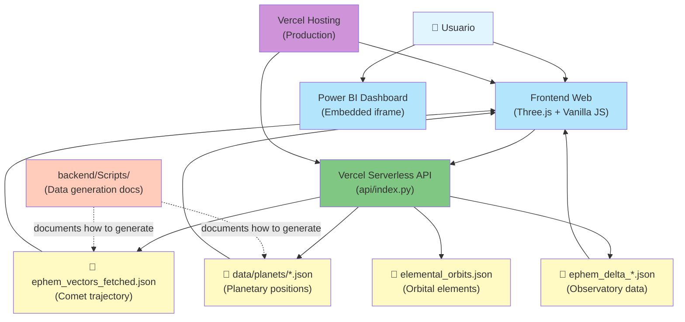

# 3I/ATLAS Simulation - Architecture

## System Architecture

## Technology Stack

### Frontend
- **Three.js** (v0.158.0) - 3D visualization engine
- **Vanilla JavaScript** - No framework dependencies
- **HTML5/CSS3** - Modern responsive design
- **Embedded Power BI** - Analytics dashboard (iframe)

### Backend
- **Vercel Serverless Functions** - Python HTTP handlers
- **Python 3.11+** - Runtime environment
- **Standard Library Only** - No external dependencies in production

### Data Storage
- **Static JSON Files** - Pre-computed ephemeris data
- **GitHub Repository** - Version control and storage
- **Vercel CDN** - Fast global data delivery

### Hosting & Deployment
- **Vercel** - Serverless hosting platform
- **Custom Domain Support** - Production-ready URLs
- **Automatic HTTPS** - SSL certificates included

## API Endpoints

| Endpoint | Method | Description | Data Source |
|----------|--------|-------------|-------------|
| `/api/vectors` | GET | Heliocentric state vectors of 3I/ATLAS | `ephem_vectors_fetched.json` |
| `/api/planets` | GET | All planetary positions (aggregated) | `data/planets/*.json` |
| `/api/planets/{name}` | GET | Specific planet position data | `data/planets/{name}.json` |
| `/api/deltas/{location}` | GET | Topocentric data for observatory | `ephem_delta_{location}.json` |
| `/api/orbits` | GET | Orbital elements | `elemental_orbits.json` |

## Data Files

### Core Ephemeris Data
- `ephem_vectors_fetched.json` - 3I/ATLAS heliocentric positions (X, Y, Z, VX, VY, VZ)
- `elemental_orbits.json` - Keplerian orbital elements

### Planetary Data (8 files)
- `data/planets/mercury.json` through `neptune.json`
- Format: `{"times": [...], "positions": [...]}`

### Observatory Data (4 locations)
- `ephem_delta_lapalma.json` - La Palma Observatory
- `ephem_delta_maunakea.json` - Mauna Kea Observatory
- `ephem_delta_paranal.json` - Paranal Observatory
- `ephem_delta_sanpedromartir.json` - San Pedro Mártir Observatory

## Development Documentation

### Data Generation Scripts (`backend/Scripts/`)
**Purpose**: Documentation of how original JSON data files were generated

- `generate_planet_ephem.py` - Logic for planetary position calculations
- `save_planet_ephem.py` - Script to generate planet JSON files
- `fetch_mpc_ephem.py` - MPC (Minor Planet Center) data fetching utilities

**Note**: These scripts are **not executed in production**. They serve as reference documentation showing the methodology used to create the static JSON files.
---
